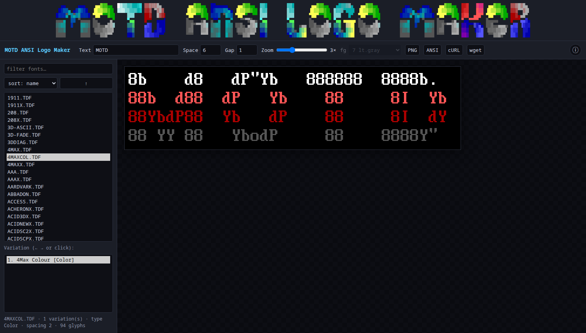
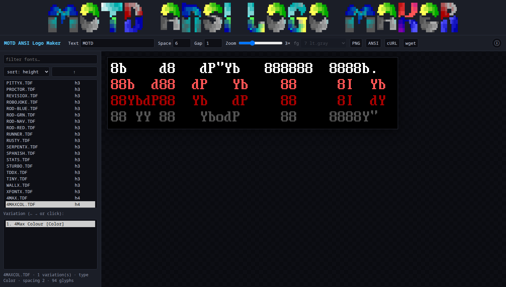
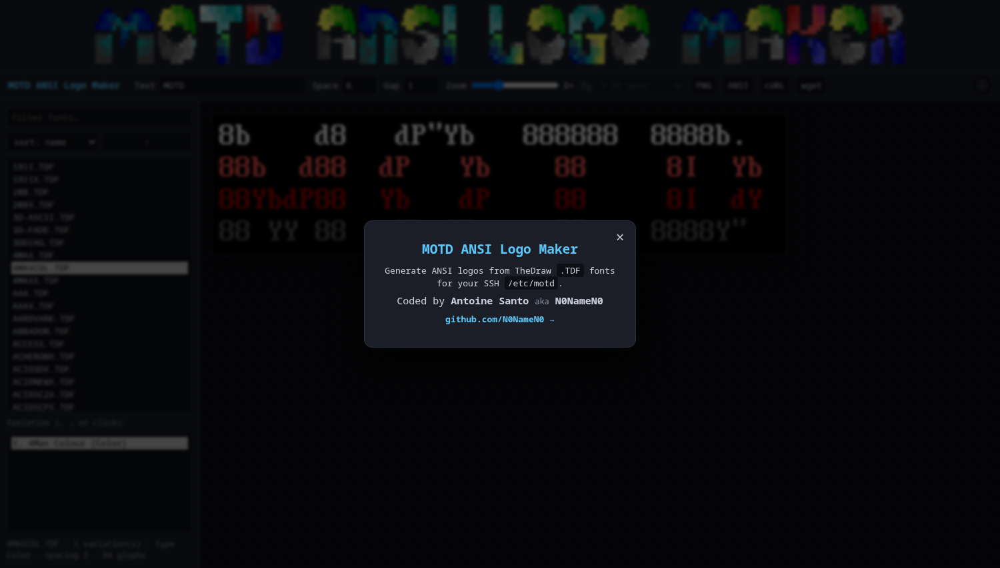
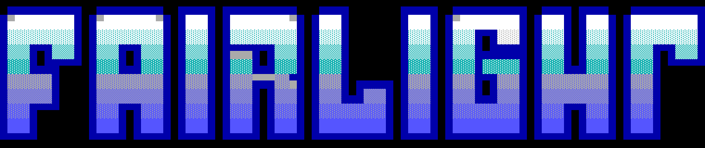
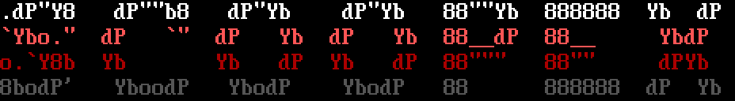
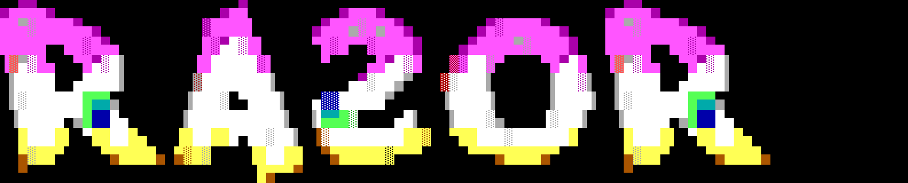
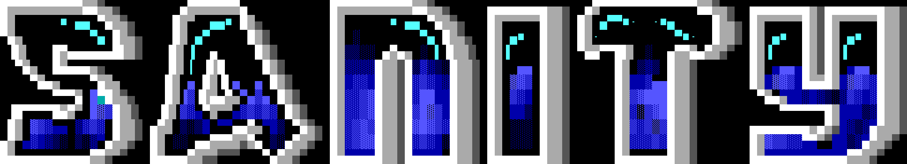

# MOTD ANSI Logo Maker

<p align="center">
  <a href="https://malm.santo.fr"></a>
</p>

<p align="center">
  <b>▶ Live app: <a href="https://malm.santo.fr">https://malm.santo.fr</a></b>
</p>

Generate colourful **ANSI logos** from classic **TheDraw `.TDF`** fonts - perfect for an
SSH **`/etc/motd`** banner. Browse the bundled font collection, type your text, tweak
spacing / gap / zoom, preview a **pixel-perfect VGA rendering** in the browser, then export
to **PNG** or **ANSI**, or copy a ready-to-paste **curl / wget** command that writes the
result straight to `/etc/motd`.

---

## Features

- **1197 TheDraw `.TDF` fonts** bundled, with all variations per file.
- Faithful **VGA / ANSI rendering** on an HTML canvas, composited from two sprite sheets
  (`bg.png` = 8 ANSI backgrounds, `ft.png` = 256 CP437 glyphs x 16 colours).
- Supports the three TDF font types: **Color**, **Block** and **Outline**
  (a foreground colour picker is enabled for the non-colour types).
- **Live controls**: text, space width, inter-character gap, integer **zoom**
  (pixel-perfect, DPR-aware - 1 canvas pixel = 1 physical pixel).
- **Font list** with instant text **filter** and **sort** by name / height / variations / type
  (metrics computed once and **cached server-side** in `metrics.json`, auto-rebuilt when the
  font count changes).
- **Exports**: `PNG` (at the displayed zoom) and `ANSI` (`.ans`, UTF-8 + SGR colour escapes).
- **One-click MOTD**: the `cURL` / `wget` buttons copy a command that renders your logo and
  pipes it to `/etc/motd`.
- **State persistence** (text, font, variation, zoom, sort...) in `localStorage`.

## Screenshots

| Sort by glyph height (aligned metric column) | About |
|---|---|
|  |  |

## Gallery

A few Amiga demo-group names rendered through the API (each in a different `.TDF` font):

| | |
|---|---|
| **FAIRLIGHT** — `1911.TDF` | **SCOOPEX** — `4MAXCOL.TDF` |
|  |  |
| **RAZOR 1911** — `ACIDTRON.TDF` | **SANITY** — `ACID3DX.TDF` |
|  |  |

```bash
# e.g. the FAIRLIGHT logo above:
curl -s 'https://malm.santo.fr/api.php?action=ansi&file=1911.TDF&text=FAIRLIGHT&space=6&gap=1'
```

## How it works

Each glyph cell is a `(character, attribute)` pair. The renderer composites, per 8x16 cell:

1. the **background** block from `bg.png` at `bg = (attr >> 4) & 7`;
2. the **glyph** from `ft.png` at `(charCode, fg = attr & 15)`, with black keyed to transparent.

The same logic exists **client-side** (canvas, in `index.php`) and **server-side**
(`tdf.php` -> `tdf_render_ansi()`), so the browser preview and the `curl` output match.

```
Project layout
  index.php        UI + canvas renderer (HTML/CSS/JS)
  api.php          JSON / ANSI HTTP API
  tdf.php          .TDF binary parser + ANSI renderer (PHP)
  bg.png ft.png    VGA sprite sheets (8 bg colours / 256x16 glyphs)
  logo.png         app banner
  fonts/           1197 .TDF font files
  metrics.json     generated cache (gitignored)
```

## HTTP API

Base URL: `https://malm.santo.fr`

| Endpoint | Description |
|---|---|
| `api.php?action=list` | JSON array of available `.TDF` file names |
| `api.php?action=metrics` | `{ "FILE.TDF": [height, width, nVariations, type], ... }` (cached) |
| `api.php?action=font&file=FILE.TDF` | Full parsed font: variations + glyph cell grids |
| `api.php?action=ansi&file=&var=&text=&space=&gap=&fg=&color=` | **Rendered ANSI text** |

`action=ansi` parameters: `file` (required), `var` (variation index, 0), `text` (`HELLO`),
`space` (6), `gap` (1), `fg` (default foreground 0-15 for non-colour fonts, 7), `color` (`1`/`0`).

## Examples

Plain text render (`color=0`), `4MAX.TDF`, text `MOTD`:

```
8b    d8   dP"Yb   888888  8888b.  
88b  d88  dP   Yb    88     8I  Yb 
88YbdP88  Yb   dP    88     8I  dY 
88 YY 88   YbodP     88    8888Y"  
```

See it in your terminal (colours included):

```bash
curl -s 'https://malm.santo.fr/api.php?action=ansi&file=4MAXCOL.TDF&text=HELLO&space=6&gap=1'
```

Write a logo straight into the MOTD (what the **cURL** / **wget** buttons copy):

```bash
curl -s 'https://malm.santo.fr/api.php?action=ansi&file=4MAXCOL.TDF&text=HELLO&space=6&gap=1' > /etc/motd
wget -qO- 'https://malm.santo.fr/api.php?action=ansi&file=4MAXCOL.TDF&text=HELLO&space=6&gap=1' > /etc/motd
```

> `/etc/motd` is root-owned; if you are not root use `... | sudo tee /etc/motd >/dev/null`.

## UI guide

- Type your **text** in the toolbar; **digits and punctuation are allowed**.
- **Left / Right** cycle the variations of a multi-font file.
- **Filter** box narrows the list; **sort** dropdown + arrow button reorder it.
- **fg** picker sets the colour for Block / Outline fonts (disabled for Color fonts).
- **PNG / ANSI** download the artwork; **cURL / wget** copy a MOTD command.

## Requirements

- A web server with **PHP** (tested on lighttpd + PHP-CGI/FPM).
- PHP `iconv` extension (CP437 -> UTF-8 for ANSI output).
- Drop the folder under your web root and open `index.php`.
- The metrics cache is stored in the **system temp dir** and rebuilt automatically (on first
  use, and whenever the font count changes) - no special write permission on the app directory
  is required, so a plain `git clone` + vhost just works.

## Credits

UI, parser and renderer by **Antoine Santo (N0NameN0)**.
Font format: *TheDraw* by Ian E. Davis. `.TDF` collection from the classic ANSI-art archives.
